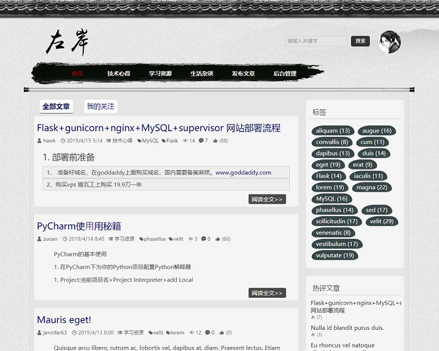
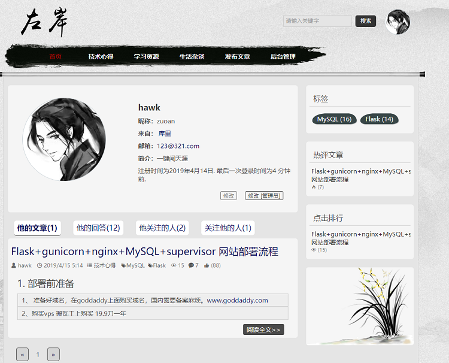
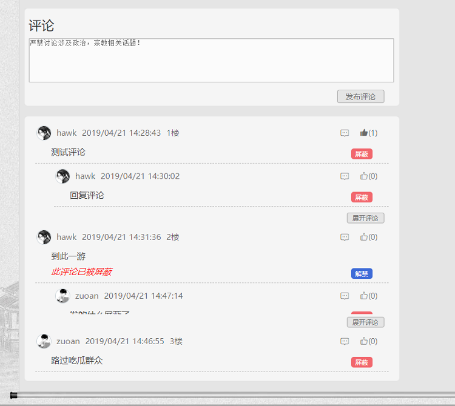
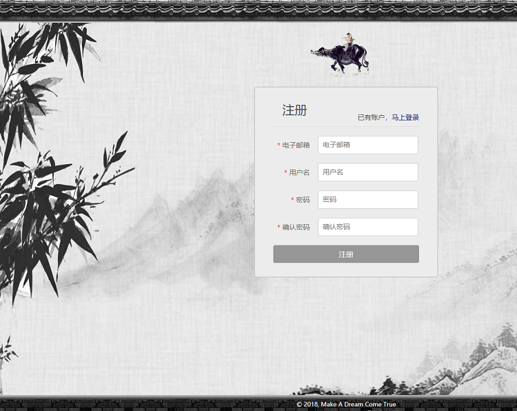

# Flask-Web

基于`python3.6.5`和`Flask0.12.2`的博客(论坛)系统。   

## 主要实现功能：
- 用户的登录、注册，上传修改头像及用户的权限角色管理
- 用户关注和取消关注
- 文章、分类、标签的添加、删除、编辑
- 支持文章全文搜索。
- 完整的评论功能，包括回复评论、评论点赞、评论屏蔽
- 侧边栏实现热评文章，点击排行，标签云
- 支持后台管理
- 使用`flask-cache`实现缓存，缓存在`redis`中
## 安装依赖环境
安装数据库MySQL：
`sudo apt-get install mysql-server mysql-client` # 中途会让你输入一次root用户密码

安装部署相关依赖：
`sudo apt-get install -y virtualenv nginx supervisor gunicorn`

创建虚拟环境、使用pip安装依赖包：  
`pip install -r requirements.txt`

### 配置
一些常量参数配置在`settiong.py`中
数据库、`SECRET_KEY`配置都是在`config.py`中，这些我都写在环境变量中去获取，设置相应的环境变量。

我是在`Ubuntu`环境中使用`Nginx`+`Gunicorn`+`supervisor`来部署的，具体可参考我的这篇笔记：

>[Flask+Mysql+Nginx+Gunicorn+Supervisor 网站部署 流程](http://note.youdao.com/noteshare?id=&sub=B0F74E8E77D94B93AE37A37E3E9F3A32)

## 运行

### 创建数据库
在项目目录下执行`python manage.py shell`
`db.create_all()` 创建数据表，（要提前创建好所使用的数据库）
`Role.insert_roles()` 生成管理角色

### 创建超级用户
`python manage.py createsuperuser`

### 开始运行：
`python manage.py runserver`

 如果成功运行起来，浏览器打开: http://127.0.0.1:8000/  就可以看到效果了。

##效果图

首页

个人页

评论页

注册页

